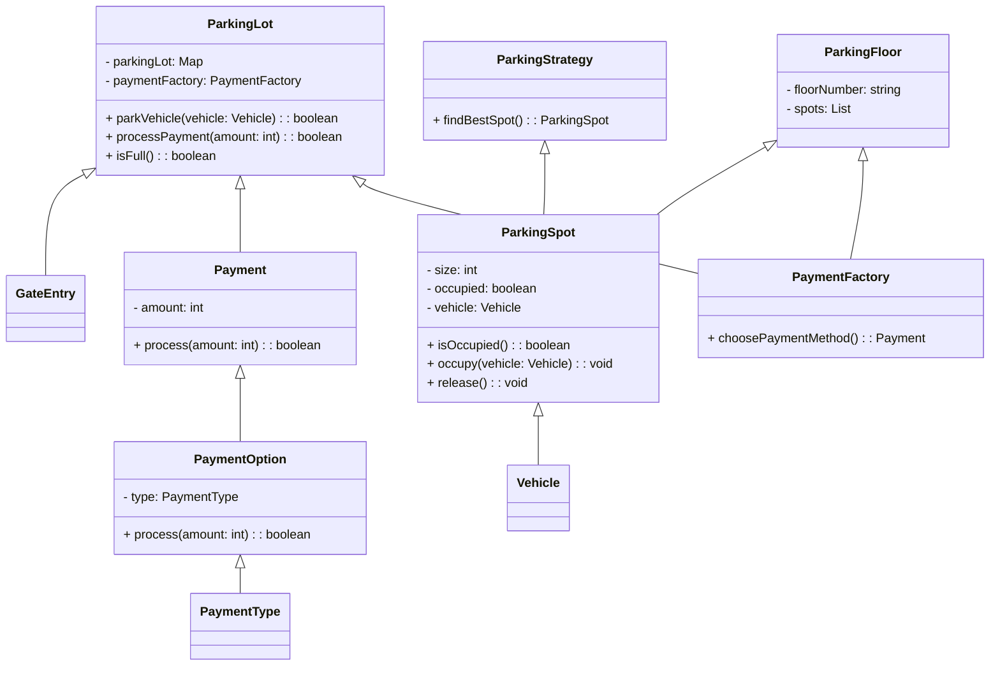

```mermaid
classDiagram
  class ParkingLot {
    - parkingLot: Map<string, ParkingFloor>
    - paymentFactory: PaymentFactory
    + parkVehicle(vehicle: Vehicle): boolean
    + processPayment(amount: int): boolean
    + isFull(): boolean
  }

  class GateEntry {
  }

  class Payment {
    - amount: int
    + process(amount: int): boolean
  }

  class ParkingSpot {
    - size: int
    - occupied: boolean
    - vehicle: Vehicle
    + isOccupied(): boolean
    + occupy(vehicle: Vehicle): void
    + release(): void
  }

  class ParkingFloor {
    - floorNumber: string
    - spots: List<ParkingSpot>
  }

  class PaymentFactory {
    + choosePaymentMethod(): Payment
  }

  class PaymentOption {
    - type: PaymentType
    + process(amount: int): boolean
  }

  class PaymentType {
  }

  class ParkingStrategy {
    + findBestSpot(): ParkingSpot
  }

  class Vehicle {
  }

  ParkingLot <|-- GateEntry
  ParkingLot <|-- Payment
  ParkingLot <|-- PaymentFactory
  ParkingFloor <|-- ParkingSpot
  ParkingFloor <|-- PaymentFactory
  Payment <|-- PaymentOption
  PaymentOption <|-- PaymentType
  ParkingSpot <|-- Vehicle
  ParkingStrategy <|-- ParkingSpot
```
